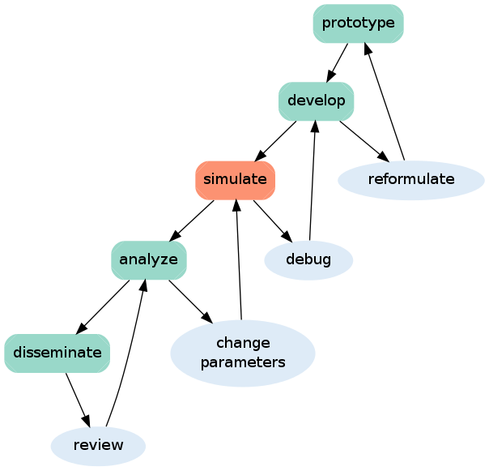
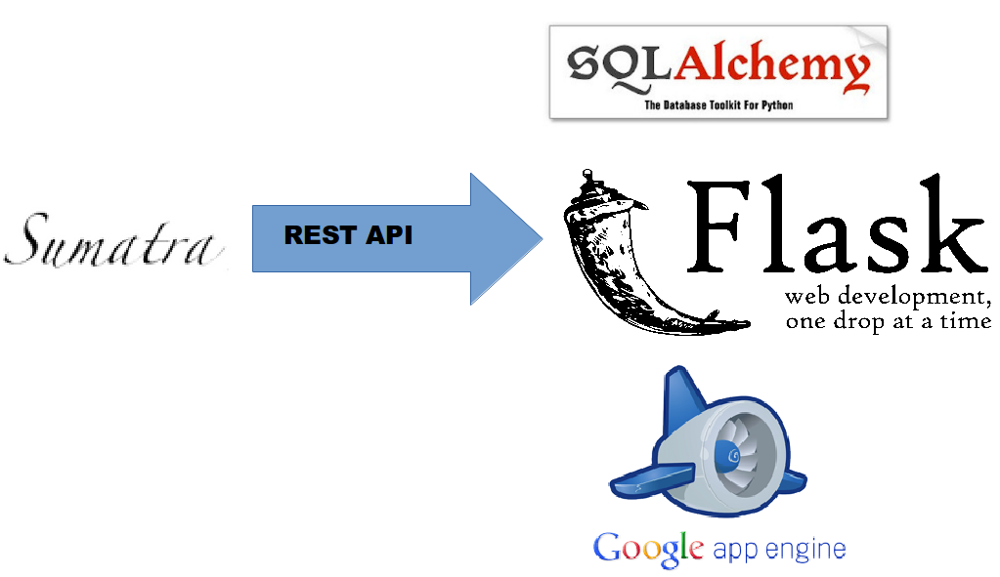
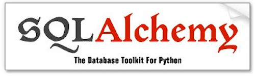

% Title
% Daniel Wheeler
% 2014-04-27

# {#overview .step data-scale=8}

   
# {#title .step data-y=-2500 data-scale=4}

Simulation Management Tools

    Daniel Wheeler &bull;
    December 12, 2014

# {#automate .step data-y=200 data-x=-2400}

# {#automate .step data-y=200 data-x=-2400}

 

 Automate 

# About me {#aboutme .step data-y=200 data-x=-800}

 
scientific/academic code developer
 
 
develop scientific Python tools
 
 
run/manage simulations
 
 
interested in reproducible research, see <code class="twitter">@wd15dan</code>

# Interested in... {.step data-y=200 data-x=800}

 
logging simulations   
replicating simulations   
building upon existing simulations   
meta-data standards for simulations   
curating simulations   
integration tests for simulations  

<b>Automate with open source tools!</b>

# Scientific Development Process {.step data-y=200 data-x=2400}

 
</img>

# Core Issues {#orthogonal .step data-y=1500 data-x=-2400}

  workflow control
   version control
   
 event control 

# Version Control {.step data-y=1500 data-x=-800}

</img>
 
maintains history of code changes 
 
 
but not code usage
 
 
integrated into scientific code development

# Event Control {.step data-y=1500 data-x=800 }

 
provide a **unique ID (SHA checksum)** for every workflow execution
 
 
capture **metadata**, not data
 
 
**not** workflow control or version control
 
 
partial solution: **Sumatra**, a simulation management tool

# Client-Side Solution: Sumatra {.step data-x=2400 data-y=1500}

 
**doesn't change my workflow**
 
 
records the **metadata** (not the data): parameters, environment, data
location, time stamps, commit message, duration, data hash
 
 
generates **unique ID** for each simulation

# Demonstration {#easytouse1 .step data-x=-2400 data-y=2800}

 

~~~~{.console}
$ smt init smt-demo
$ smt configure --executable=python --main=script.py
$ # python script.py params.json
$ smt run --tag=demo --reason="create demo record" params.json wait=3
Record label for this run: '0c50797f1e3f'
No data produced.
Created Django record store using SQLite
~~~~

# Local Web Interface {#webinterface .step data-x=-800 data-y=2800}

<iframe width="100%" height="100%" src="http://127.0.0.1:8000/" frameborder="0" border="0"> </iframe>

# Server-Side Solution {.step data-x=800 data-y=2800}

<iframe width="70%" height="20%" style="position: relative; top: 50px; left: 100px;" src="http://127.0.0.1:5000/" frameborder="0" border="0"> </iframe>

</img>

<!-- </img> -->
<!-- </img> -->
<!-- </img> -->

# Thanks! {.step data-x=2400 data-y=2800}

 
slides: [wd15.github.io/nims-visit-2014](http://wd15.github.io/nims-visit-2014/)
 
 
sumatra demo: [github.com/wd15/smt-demo](https://github.com/wd15/smt-demo)
